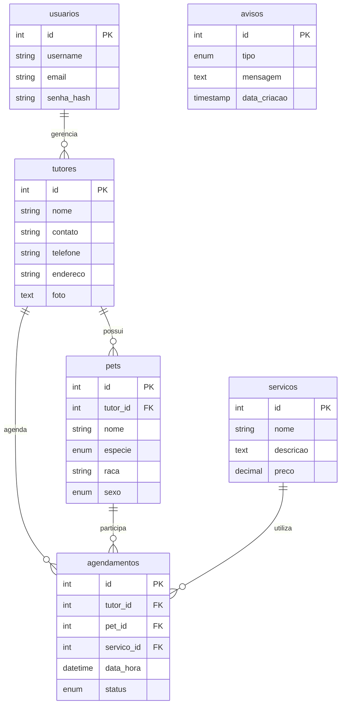

# MiAu — Documentação da API REST

> Documentação no estilo OpenAPI/Swagger do backend MiAu e seu mapeamento com o banco MariaDB `miau_db`.
>
> **Swagger interativo (recomendado para apresentação):** acesse `/docs` com o servidor rodando.

| Ambiente | Swagger UI | OpenAPI JSON |
|----------|------------|--------------|
| Local | http://127.0.0.1:8000/docs | http://127.0.0.1:8000/openapi.json |
| Produção (Vercel) | https://mi-au.vercel.app/docs | https://mi-au.vercel.app/openapi.json |

O arquivo [`docs/openapi.json`](openapi.json) inclui `servers` (local + Vercel), esquemas de auth OAuth2 e Bearer JWT, e está pronto para importar no Swagger Editor/Studio ou Postman.

**Swagger Hub:** use [`docs/openapi.yaml`](openapi.yaml) e siga [`docs/SWAGGER-HUB-IMPORT.md`](SWAGGER-HUB-IMPORT.md) — e necessario **colar o arquivo inteiro** no editor (a API hospedada no Hub nao atualiza sozinha).

---

## Informações gerais

| Campo | Valor |
|-------|-------|
| **Título** | MiAu API REST |
| **Versão** | 1.0.0 |
| **Base URL local** | `http://127.0.0.1:8000` |
| **Formato** | JSON |
| **Autenticação** | JWT Bearer Token |
| **Banco de dados** | MariaDB / MySQL — `miau_db` |

### Como autenticar

1. Envie `POST /auth/login` com `username` e `password` (form-urlencoded).
2. Copie o `access_token` da resposta.
3. Nas rotas protegidas, inclua o header:

```
Authorization: Bearer {seu_token_aqui}
```

**Usuário padrão (após `setup_db.py`):** `ShardCadu` / `cadu123`

---

## Modelo de dados (Banco)



| Tabela | Descrição | Endpoints relacionados |
|--------|-----------|------------------------|
| `usuarios` | Login e perfil do sistema | `/auth/*` |
| `tutores` | Donos dos pets | `/api/tutores` |
| `pets` | Pacientes (Cachorro/Gato) | `/api/pets` |
| `servicos` | Catálogo de serviços | `/api/servicos` |
| `agendamentos` | Consultas e banhos | `/api/agendamentos` |
| `avisos` | Mural de avisos | `/api/avisos` |

---

## Endpoints — Autenticação

Tag: **Autenticação** | Prefixo: `/auth`

### POST `/auth/login`

Autentica usuário e retorna token JWT.

| Parâmetro | Onde | Tipo | Obrigatório | Descrição |
|-----------|------|------|-------------|-----------|
| `username` | body (form) | string | Sim | Nome de usuário |
| `password` | body (form) | string | Sim | Senha |

**Content-Type:** `application/x-www-form-urlencoded`

**Resposta 200:**
```json
{
  "access_token": "eyJhbGciOiJIUzI1NiIsInR5cCI6IkpXVCJ9...",
  "token_type": "bearer"
}
```

**Erros:** `401` — usuário ou senha incorretos

---

### POST `/auth/register`

Cadastra novo usuário no sistema.

**Body (JSON):**
```json
{
  "username": "novo_user",
  "email": "user@miau.com",
  "password": "senha123"
}
```

**Resposta 200:** mesmo formato do login (token JWT)

**Erros:** `400` — usuário ou e-mail já cadastrado

---

### GET `/auth/me`

Retorna perfil do usuário autenticado. **Requer JWT.**

**Resposta 200:**
```json
{
  "username": "ShardCadu",
  "email": "cadu.sport@miau.com"
}
```

---

### PUT `/auth/me`

Atualiza perfil do usuário autenticado. **Requer JWT.**

**Body (JSON):**
```json
{
  "username": "ShardCadu",
  "email": "cadu.sport@miau.com",
  "password": "nova_senha_opcional"
}
```

**Resposta 200:**
```json
{ "message": "Perfil atualizado com sucesso" }
```

---

## Endpoints — Tutores

Tag: **Tutores** | Prefixo: `/api/tutores` | **Requer JWT**

Tabela: `tutores`

| Método | Rota | Ação | Status |
|--------|------|------|--------|
| GET | `/api/tutores` | Listar todos | 200 |
| POST | `/api/tutores` | Criar | 200 |
| PUT | `/api/tutores/{tutor_id}` | Atualizar | 200 |
| DELETE | `/api/tutores/{tutor_id}` | Excluir | 200 |

**Body POST/PUT:**
```json
{
  "nome": "João Silva",
  "contato": "joao@email.com",
  "telefone": "(11) 98888-1111",
  "endereco": "Rua das Flores, 123",
  "foto": "data:image/png;base64,..."
}
```

`foto` é opcional — string base64 (data URL) da imagem do tutor.

**Migração em banco existente:**
```sql
ALTER TABLE tutores ADD COLUMN foto MEDIUMTEXT NULL;
```

**Resposta GET (item):**
```json
{
  "id": 1,
  "nome": "João Silva",
  "contato": "joao@email.com",
  "telefone": "(11) 98888-1111",
  "endereco": "Rua das Flores, 123",
  "foto": null
}
```

---

## Endpoints — Pets

Tag: **Pets** | Prefixo: `/api/pets` | **Requer JWT**

Tabela: `pets` (FK → `tutores.id`)

| Método | Rota | Ação |
|--------|------|------|
| GET | `/api/pets` | Listar |
| POST | `/api/pets` | Criar |
| PUT | `/api/pets/{pet_id}` | Atualizar |
| DELETE | `/api/pets/{pet_id}` | Excluir |

**Body POST/PUT:**
```json
{
  "nome": "Rex",
  "especie": "Cachorro",
  "raca": "Golden Retriever",
  "sexo": "M",
  "tutor_id": 1
}
```

| Campo | Valores permitidos |
|-------|-------------------|
| `especie` | `Cachorro`, `Gato` |
| `sexo` | `M`, `F` |

---

## Endpoints — Serviços

Tag: **Serviços** | Prefixo: `/api/servicos` | **Requer JWT**

Tabela: `servicos`

| Método | Rota | Ação |
|--------|------|------|
| GET | `/api/servicos` | Listar |
| POST | `/api/servicos` | Criar |
| DELETE | `/api/servicos/{id}` | Excluir |

**Body POST:**
```json
{
  "nome": "Banho e Tosa",
  "descricao": "Banho completo com tosa higiênica",
  "preco": 89.90
}
```

---

## Endpoints — Agendamentos

Tag: **Agendamentos** | Prefixo: `/api/agendamentos` | **Requer JWT**

Tabela: `agendamentos` (FKs → tutores, pets, servicos)

| Método | Rota | Ação |
|--------|------|------|
| GET | `/api/agendamentos` | Listar |
| POST | `/api/agendamentos` | Criar |
| DELETE | `/api/agendamentos/{id}` | Excluir |

**Body POST:**
```json
{
  "tutor_id": 1,
  "pet_id": 1,
  "servico_id": 1,
  "data_hora": "2026-06-15T14:30:00",
  "status": "Agendado"
}
```

| Campo `status` | Valores |
|----------------|---------|
| status | `Agendado`, `Em Andamento`, `Concluido`, `Cancelado` |

---

## Endpoints — Avisos

Tag: **Avisos** | Prefixo: `/api/avisos` | **Requer JWT**

Tabela: `avisos` (alimenta o Mural na Home)

| Método | Rota | Ação |
|--------|------|------|
| GET | `/api/avisos` | Listar (ordenado por data) |
| POST | `/api/avisos` | Criar |
| DELETE | `/api/avisos/{aviso_id}` | Excluir |

**Body POST:**
```json
{
  "tipo": "Urgente",
  "mensagem": "Clínica fechará mais cedo hoje."
}
```

| Campo `tipo` | Valores |
|--------------|---------|
| tipo | `Urgente`, `Aviso`, `Lembrete` |

---

## Códigos de resposta HTTP

| Código | Significado |
|--------|-------------|
| 200 | Sucesso |
| 400 | Dados inválidos ou regra de negócio |
| 401 | Token ausente, inválido ou credenciais incorretas |
| 422 | Validação Pydantic (campos obrigatórios/formato) |
| 500 | Erro interno / banco de dados |

---

## Exemplo completo (cURL)

```bash
# 1. Login
TOKEN=$(curl -s -X POST http://127.0.0.1:8000/auth/login \
  -d "username=ShardCadu&password=cadu123" | python -c "import sys,json; print(json.load(sys.stdin)['access_token'])")

# 2. Listar tutores
curl -H "Authorization: Bearer $TOKEN" http://127.0.0.1:8000/api/tutores

# 3. Criar tutor
curl -X POST http://127.0.0.1:8000/api/tutores \
  -H "Authorization: Bearer $TOKEN" \
  -H "Content-Type: application/json" \
  -d '{"nome":"Maria","contato":"maria@email.com","telefone":"(11) 99999-0000","endereco":"Av. Paulista, 1000"}'
```

---

## Ferramentas externas (Swagger Editor, Postman, Insomnia)

A API já publica o spec OpenAPI 3. Não é necessário instalar outro servidor Swagger — basta importar o arquivo ou a URL.

### Regenerar o spec (após mudar endpoints)

```bash
python scripts/export_openapi.py
```

Equivalente com servidor rodando (`python app.py`):

```bash
curl -s http://127.0.0.1:8000/openapi.json -o docs/openapi.json
```

### Swagger Editor

1. Abra [editor.swagger.io](https://editor.swagger.io)
2. **File → Import file** → selecione [`docs/openapi.json`](openapi.json)
3. Use **Authorize** → informe usuário/senha (`ShardCadu` / `cadu123`) ou escolha **BearerJWT** e cole só o token
4. Selecione o **servidor** no topo (Local ou Produção Vercel) antes de **Try it out**

### Postman

1. **Import → File or Link**
   - Arquivo: [`docs/openapi.json`](openapi.json)
   - URL produção: `https://mi-au.vercel.app/openapi.json`
2. Importe também (opcional, facilita JWT):
   - Environment: [`docs/postman/MiAu.postman_environment.json`](postman/MiAu.postman_environment.json)
   - Collection login: [`docs/postman/MiAu-Login.postman_collection.json`](postman/MiAu-Login.postman_collection.json)
3. Selecione o environment **MiAu Local**
4. Execute **POST Login** — o token é salvo em `{{access_token}}`
5. Na collection importada do OpenAPI: **Authorization → Bearer Token** → `{{access_token}}`

### Insomnia

1. **Application → Import** → [`docs/openapi.json`](openapi.json)
2. Crie um request `POST {{ base_url }}/auth/login` (form: username, password)
3. Copie `access_token` e use header `Authorization: Bearer ...` nos demais requests

### Autenticação JWT (resumo)

| Passo | Detalhe |
|-------|---------|
| Login | `POST /auth/login` — body `x-www-form-urlencoded`: `username`, `password` |
| Token | Campo `access_token` na resposta JSON |
| Header | `Authorization: Bearer SEU_TOKEN` em todas as rotas `/api/*` |

---

## Apresentação acadêmica

Para demonstrar ao professor Henning:

1. Inicie o servidor: `python app.py`
2. Abra **http://127.0.0.1:8000/docs** — interface Swagger UI interativa
3. Clique em **Authorize**, faça login via `/auth/login` ou cole o token Bearer
4. Teste os endpoints CRUD ao vivo na apresentação
5. Mostre o DBeaver com as tabelas `miau_db` side-by-side com a documentação

Arquivo OpenAPI estático (importável no [Swagger Editor](https://editor.swagger.io)): [`docs/openapi.json`](openapi.json)

---

*Desenvolvido por Carlos Eduardo (Cadu) — MiAu 2026.1*
